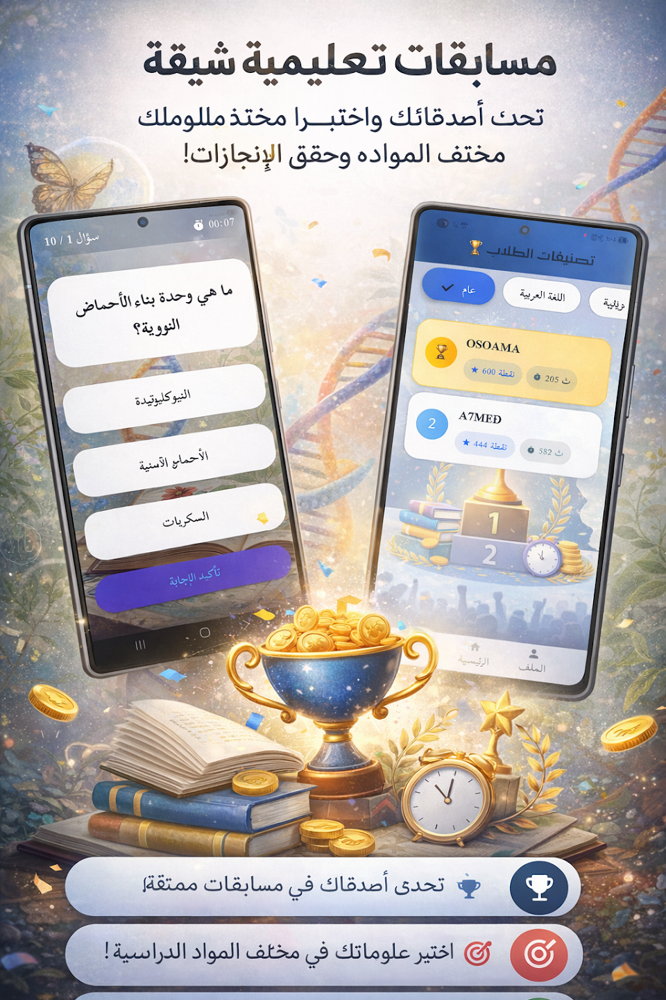
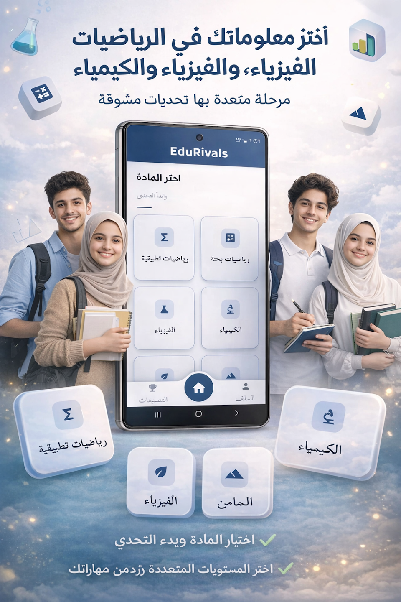
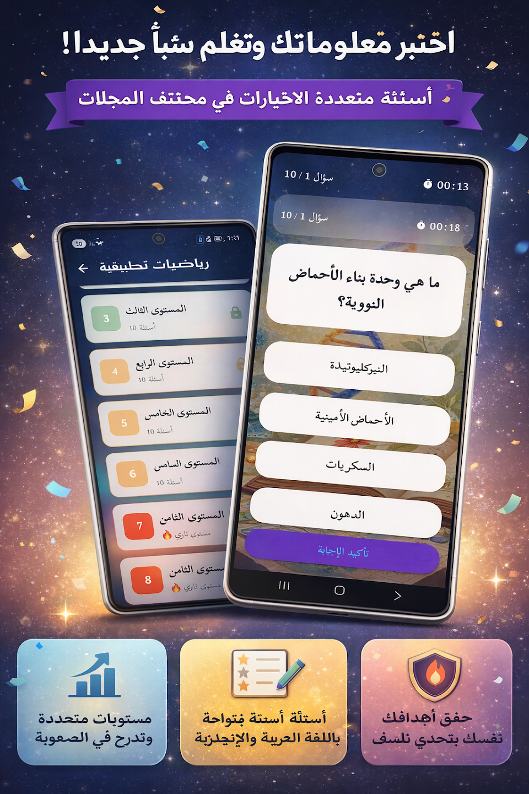

  

<h1 align="center">🏆 EDURIVALS | إيدو رايفلز</h1>

  <b>"The ultimate bridge between students and academic excellence. Fast, Competitive, and National-focused."</b>

  
  
  
  

---

## 📖 Overview | لمحة عن التطبيق
**EduRivals** is a high-performance edutainment platform engineered for scalability. It empowers Egyptian high school students to gamify their learning experience while providing a real-time, one-click solution for nationwide academic competition.

> [!IMPORTANT]
> **🛡️ Confidentiality & Intellectual Property:**
> The source code for this project is **Private & Proprietary**. This repository serves as a professional showcase for UI/UX excellence, technical architecture, and system capabilities.

---

## 📸 App Showcase (UI/UX)

  <table align="center" style="border: none; background: transparent;">
    <tr>
      <td align="center" style="border: none;">
        
         <b>Arena Interface</b>
      </td>
      <td align="center" style="border: none;">
        
         <b>Subject Progress</b>
      </td>
      <td align="center" style="border: none;">
        
         <b>National Ranking</b>
      </td>
    </tr>
  </table>

---

## ⚡ Key Highlights / Analytics

  

---

## 👤 Developer | المطور
<table style="border: none; background: transparent;">
  <tr>
    <td style="border: none; vertical-align: middle;">
      **Osama Islam (ElDeep)** 
      *Principal Mobile Engineer | Flutter Specialist* 
      *"I don't just write code; I build digital legacies."*
    </td>
    <td style="border: none; vertical-align: middle;" align="right">
      
    </td>
  </tr>
</table>

  
  

---

  © 2026 Osama ElDeep Solutions. Secure. Scalable. Superior.

