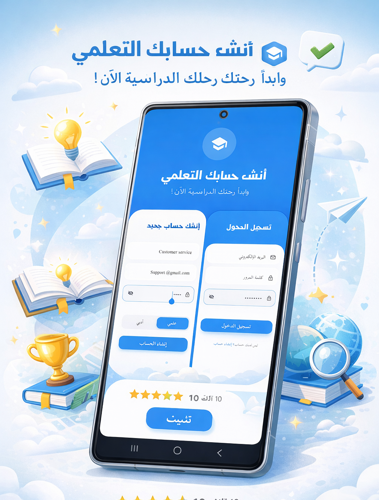

  

<h1 align="center">🏆 EDURIVALS | The Ultimate Thanaweya Challenge</h1>

  <b>"Gamifying the Egyptian High School curriculum. Compete, Rank, and Conquer your exams with speed and precision."</b>

  
  
  
  

---

## 📖 Project Vision | رؤية المشروع
**EduRivals** is a high-performance edutainment platform specifically engineered for Egyptian Secondary School students. It transforms traditional revision into a competitive arena, helping students master their curriculum through 10-level progressive challenges, real-time national rankings, and high-pressure exam simulations.

> [!IMPORTANT]
> **🛡️ Proprietary Architecture:**
> The core source code for this project is **Private**. This repository serves as a professional showcase for UI/UX engineering, state management, and large-scale data synchronization.

---

## 🔥 Key Competitive Features

### 🎮 Level-Based Mastery
* **Progressive Difficulty:** Each subject is divided into 10 levels designed to build student confidence and analytical depth.
* **Curated Content:** Questions are drafted based on previous national exams and the latest Ministry standards.

### 🏁 Real-Time National Ranking (Leaderboard)
* **Competitive Edge:** Earn points based on accuracy and response speed.
* **Live Sync:** View your rank among students nationwide in real-time.

---

## 📸 App Showcase (UI/UX)

  <table align="center" style="border: none; background: transparent;">
    <tr>
      <td align="center" style="border: none;">
        
         <b>Master the Curriculum</b>
      </td>
      <td align="center" style="border: none;">
        
         <b>Analyze Your Progress</b>
      </td>
      <td align="center" style="border: none;">
        
         <b>Challenge Yourself</b>
      </td>
      <td align="center" style="border: none;">
        
         <b>Climb the Leaderboard</b>
      </td>
    </tr>
  </table>

---

## 📱 Experience the Challenge
Get the app live on the Google Play Store:

---

## 🛠️ Technical Excellence
* **Frontend:** Flutter & Dart (Clean Architecture).
* **Backend:** Firebase (Firestore, Auth, Storage).
* **Features:** Real-time Leaderboards, Stream-based data syncing, Secure local storage.

---

## 👤 Developer | المطور
**Osama Islam (ElDeep)**
*Professional Mobile Application Developer*

  
  

---

  © 2026 EduRivals | Engineered by Osama ElDeep.

